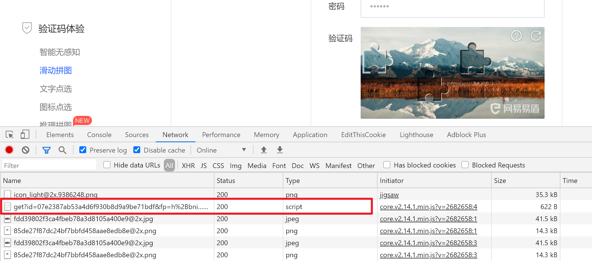
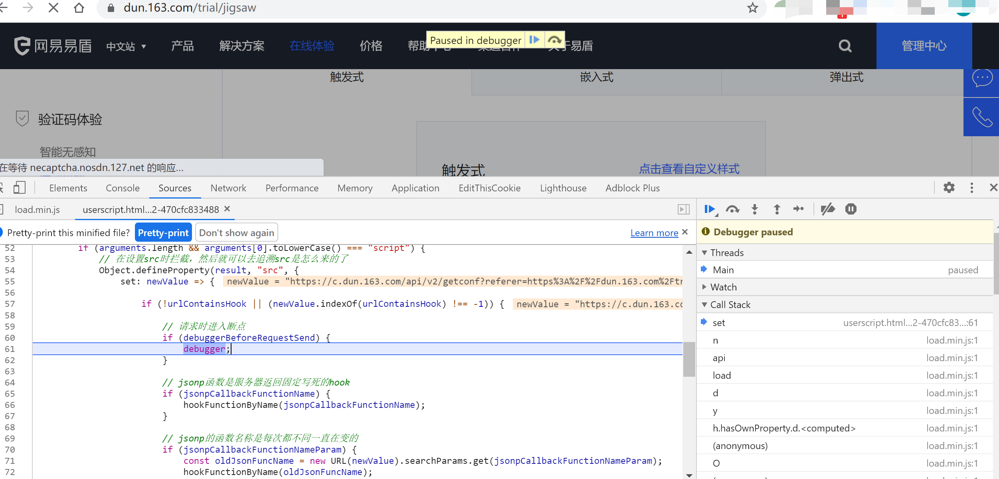

打开易盾滑块页面：  
[https://dun.163.com/trial/jigsaw](https://dun.163.com/trial/jigsaw)
切换到嵌入式。

打开开发者工具，然后清空无关请求，刷新滑块：  
  
这个get的嫌疑比较大，点进去看下它的请求响应啥的：  
  
有一些加密参数，不知道怎么来的，因为它是script类型的，所以就用此脚本打个xhr断点，复制这个请求url的一部分，别误判就行：  

`https://c.dun.163.com/api/v2/get`
然后配置到脚本中：

保存退出。

因为油猴脚本是在页面加载时注入，所以要刷新易盾的页面，重新刷新，就自动进入断点了：

然后就可以在callstack快乐的追溯了。

这是基本使用，大多数场景这么用就可以了。 

还有jsonp callback hook更多例子改天再写...

