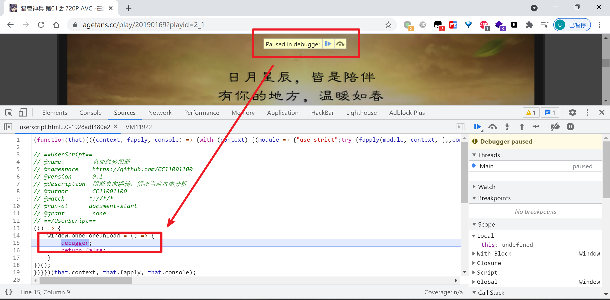
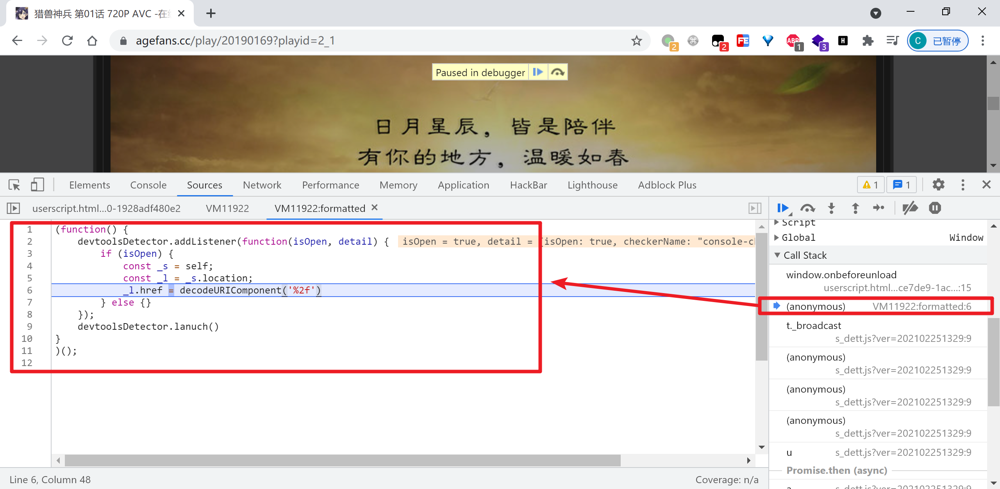

# 页面跳转JS代码定位通杀方案

## 一、原理概述

1. 通过`window.onbeforeunload`事件下一个断点，阻断跳转使其留在当前页面
2. 追栈，上一个栈帧就是跳转逻辑，秒定位。

## 二、案例 https://www.agefans.cc

这个网站在播放页面打开开发者工具会跳转到首页，来定位一下它，先打开一个空白的标签页，然后粘贴网址：  
[https://www.agefans.cc/play/20190169?playid=2_1](https://www.agefans.cc/play/20190169?playid=2_1)

然后按F12打开开发者工具，页面在跳转之前进入了断点：

然后追调用栈，上一个栈帧就是跳转逻辑：

## 三、注意

检测开发者工具是否打开的方式有很多，检测到打开之后重定向到某个页面只是一个应对行为，此工具只是用来解决一个很窄的情况。  

检测到之后重定向并不是一个好的应对行为，因为笔者注意到之前收藏的几个检测到后重定向的网站都改为了检测之后不再重定向而是其他应对策略。

