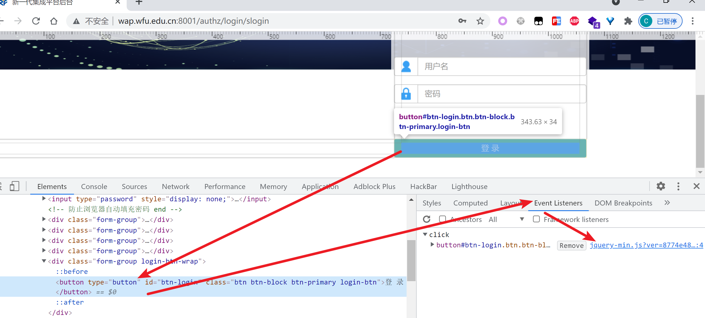
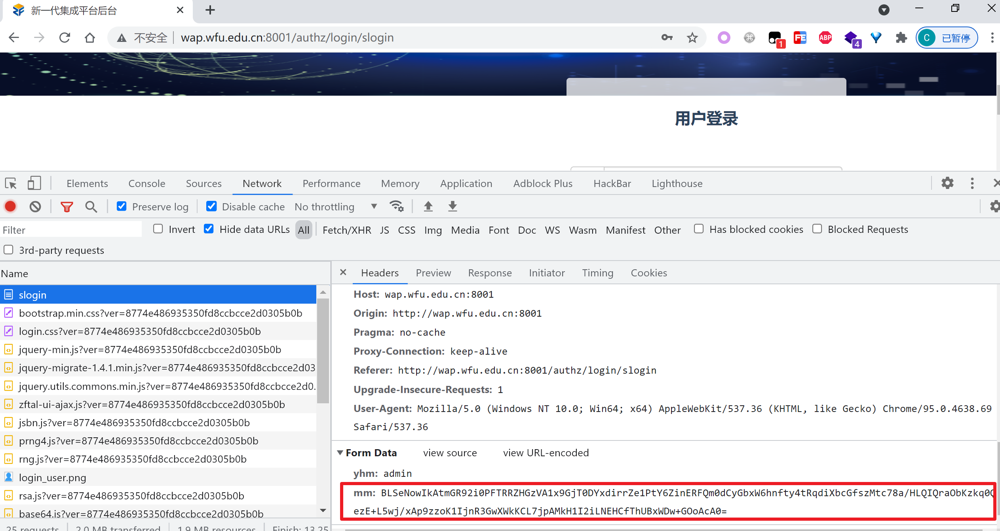
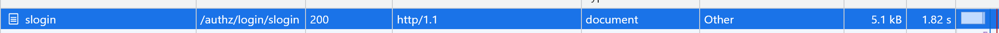
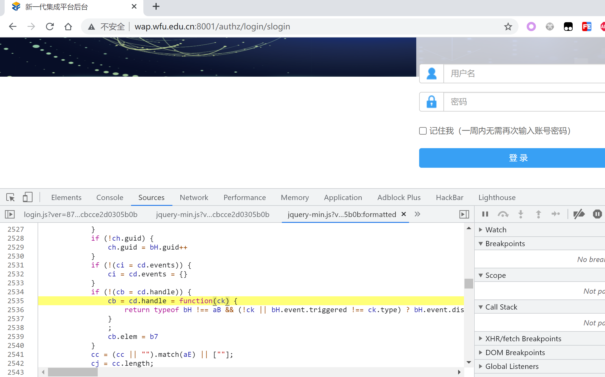
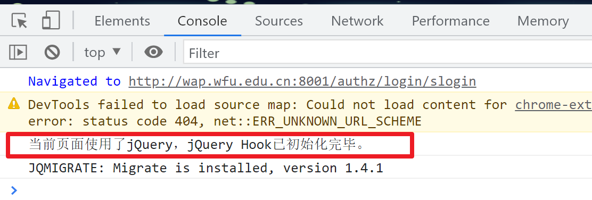
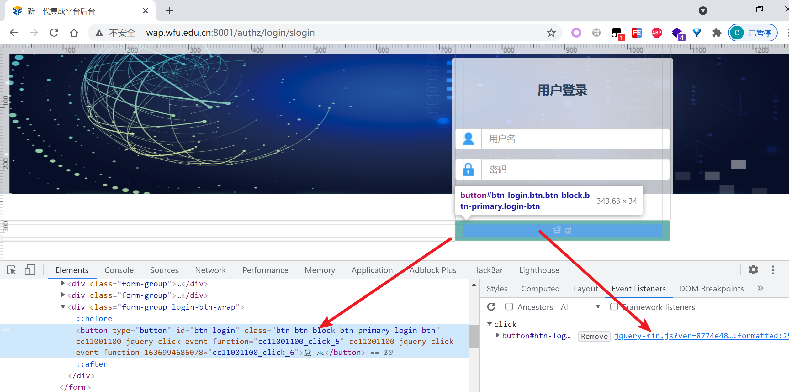
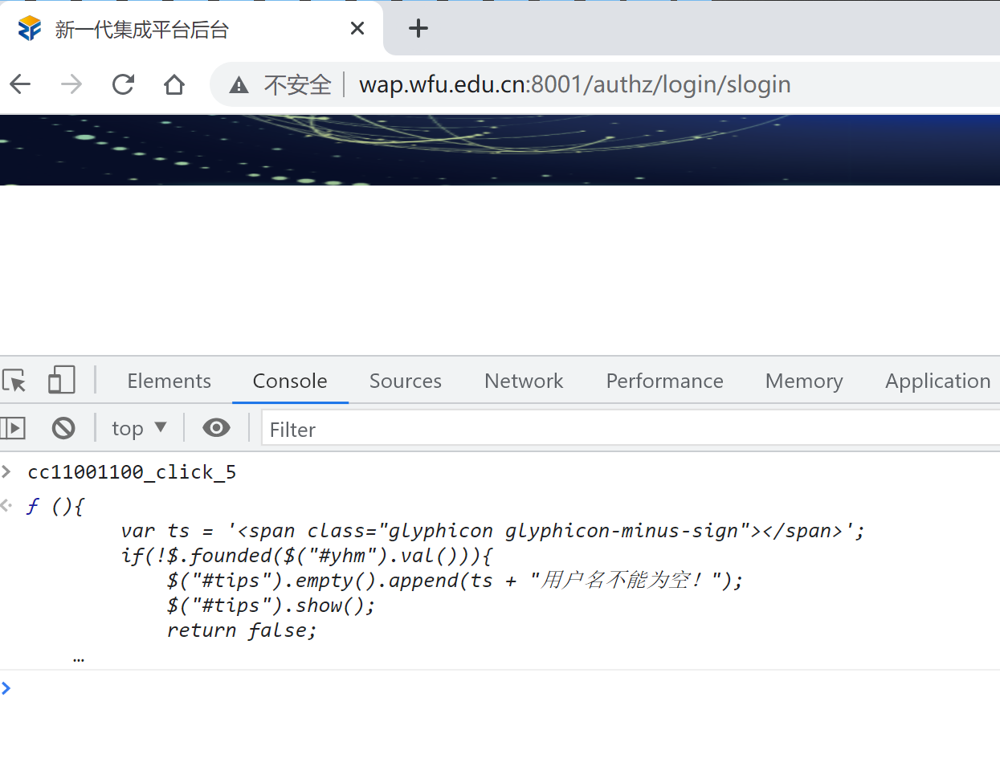
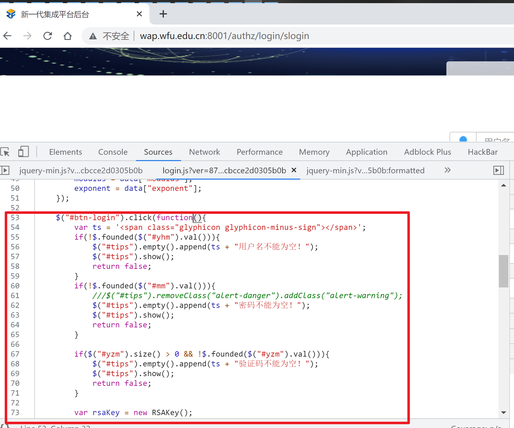
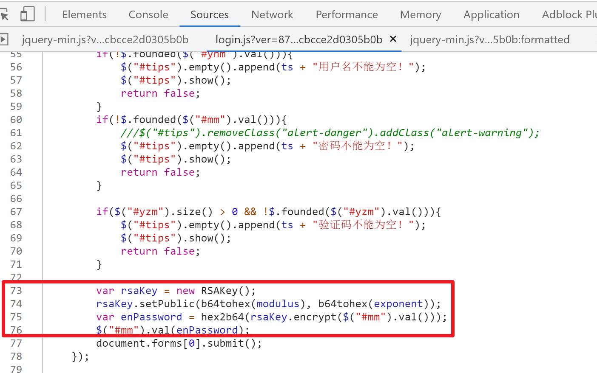

# jQuery Hook

# 一、此脚本的作用是什么？

用于快速定位使用jQuery绑定到DOM元素上的事件的代码的真实位置，辅助逆向分析。

# 二、为什么会有这个？

jQuery曾经引领过一个时代，虽然现已没落，但是很多遗留下来的系统都用到了jQuery，其市场还是比较大的， 而笔者在做js逆向的时候发现用Chrome自带的查看元素绑定事件的功能看到的值是被jQuery包裹着一层的代码：

不容易定位到事件代码逻辑真实代码所在的位置， 这个小脚本就是解决这个问题的，提供一种简单有效的方式能够快速找到jQuery事件对应的真实代码的位置。

# 三、安装
已在油猴商店上架：  
[https://greasyfork.org/zh-CN/scripts/435556-jquery-hook](https://greasyfork.org/zh-CN/scripts/435556-jquery-hook)

# 四、使用案例
随便找一个使用jQuery开发的网站，比如这个：  
[http://wap.wfu.edu.cn:8001/authz/login/slogin](http://wap.wfu.edu.cn:8001/authz/login/slogin)  
尝试触发登录请求，会发现它的登录密码是被加密的：

通过这里可以看到，是doc请求：

那么按照经验推测， 应该是单击登录按钮的时候js对明文密码加密替换然后提交表单的，
因此如果能定位到按钮的事件则很快就能定位到加密代码的位置，查看这个按钮绑定的事件，跟进去：  
  
会发现会陷入到jQuery的闭包中无法自拔：
  
油猴脚本开启本插件jQuery hook，刷新页面，如果加载成功控制台会有提示：  
  
再次对登录按钮检查元素，不必理睬右边Chrome给出的的绑定事件， 注意Elements面板中使用jQuery绑定的事件都已经以属性的方式展示出来了：
  
比如：
```text
cc11001100-jquery-click-event-function="cc11001100_click_5"
```
表示此元素上有一个click类型的事件，所关联的函数的代码已经赋值到全局变量：
```text
cc11001100_click_5
```
上，切换到console，粘贴`cc11001100_click_5`回车：

单击跟进去，直接定位到了登录按钮的click事件所绑定的代码：

往下拉，可以看到参数`mm`的加密方式：

至此梳理完毕，以比较科学的方式很轻松就定位到了加密位置。

# 五、原理概述
通过hook jQuery的$.fn原型上的一些设置事件的方法来实现，目前支持的方法：

```text
"click", "dblclick", "blur", "change", "contextmenu", "error", "focus",
"focusin", "focusout", "hover", "holdReady", "proxy", "ready", "keydown", "keypress",
"keyup", "live", "load", "mousedown", "mouseenter", "mouseleave", "mousemove", "mouseout",
"mouseover", "mouseup"
"on"
```

元素每被设置一个事件就会多一个属性，复制这个属性的值，对应着一个全局变量，在console上粘贴，这个就是此元素的此事件对应着的真实代码位置。

# 六、问题反馈

如果发现有Hook不到的情况，请在issue中反馈。


